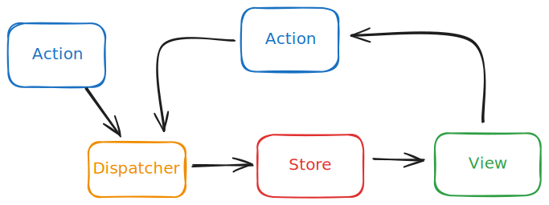

- [🧩 MÓDULO 2: Funciones y Hooks con TypeScript en React](#-módulo-2-funciones-y-hooks-con-typescript-en-react)
  - [🎯 Objetivos del módulo](#-objetivos-del-módulo)
  - [📘 Sobrecarga de funciones y tipos de retorno](#-sobrecarga-de-funciones-y-tipos-de-retorno)
    - [Sobrecarga de funciones en React](#sobrecarga-de-funciones-en-react)
    - [🧿 Uso dentro de los componente DisplayField -\> UserInfo](#-uso-dentro-de-los-componente-displayfield---userinfo)
  - [📘 Tipado de useState, useEffect y hooks básicos](#-tipado-de-usestate-useeffect-y-hooks-básicos)
    - [useState](#usestate)
      - [Tipos never y unknown](#tipos-never-y-unknown)
    - [useEffect](#useeffect)
    - [🧿 Componente Item: useEffect y el array de dependencias](#-componente-item-useeffect-y-el-array-de-dependencias)
    - [useCallback](#usecallback)
    - [useRef: acceso a elementos del DOM](#useref-acceso-a-elementos-del-dom)
      - [🧿 Componente Focus](#-componente-focus)
    - [Paso de referencias entre componentes: forwardRef](#paso-de-referencias-entre-componentes-forwardref)
    - [La prop `ref` en React 19](#la-prop-ref-en-react-19)
  - [📘 Hooks personalizados (custom hooks) tipados](#-hooks-personalizados-custom-hooks-tipados)
    - [🧿 Hook básico useToggle](#-hook-básico-usetoggle)
    - [🧿 Hook genérico useLocalStorage\<T\>()](#-hook-genérico-uselocalstoraget)
    - [Hooks personalizados y efectos](#hooks-personalizados-y-efectos)
  - [📘 Callbacks y promesas en React](#-callbacks-y-promesas-en-react)
    - [Callbacks](#callbacks)
    - [Promesas](#promesas)
    - [🧿 Estados y asincronía (promesas): componente User](#-estados-y-asincronía-promesas-componente-user)
    - [🧿 Estados, hooks y asincronía (promesas): hook UseUser](#-estados-hooks-y-asincronía-promesas-hook-useuser)
  - [🌐 Patrón Flux: reducers y actions](#-patrón-flux-reducers-y-actions)
    - [El patrón flux nativo en react: useReducer](#el-patrón-flux-nativo-en-react-usereducer)
    - [🧿 El componente `Counter` con el patrón Flux](#-el-componente-counter-con-el-patrón-flux)
      - [Definición del estado](#definición-del-estado)
      - [Acciones](#acciones)
      - [Reducer](#reducer)
      - [useReducer como evolución de useState](#usereducer-como-evolución-de-usestate)
      - [El componente: utilizando useReducer](#el-componente-utilizando-usereducer)
    - [Organización y mejoras del código](#organización-y-mejoras-del-código)
      - [Lógica Async. Thunks](#lógica-async-thunks)
      - [🌐 Contextos](#-contextos)
  - [📝 Ejercicios sugeridos](#-ejercicios-sugeridos)

## 🧩 MÓDULO 2: Funciones y Hooks con TypeScript en React

### 🎯 Objetivos del módulo

- Comprender y aplicar la sobrecarga de funciones en TypeScript.
- Declarar correctamente el tipo de retorno de funciones React.
- Tipar adecuadamente los hooks `useState`, `useEffect` y otros básicos.
- Crear y tipar hooks personalizados reutilizables.
- Tipar funciones asíncronas con promesas y callbacks en componentes React.

### 📘 Sobrecarga de funciones y tipos de retorno

La **sobrecargas de funciones** (**function overloads**) consiste en definir una función con múltiples "firmas", con diversos tipos de parámetros y de retorno, permitiendo que la función pueda ser llamada con diferentes tipos de argumentos para que devuelva si es necesario diferentes tipos de valores. El tipo de retorno se puede inferir o declarar explícitamente.

Esto es útil cuando una función puede aceptar distintos tipos de argumentos y retornar diferentes tipos según el caso.

```ts sample8.1.overload..tsx
function format(value: string): string;
function format(value: number): string;
function format(value: string | number): string {
  return typeof value === 'number' ? value.toFixed(2) : value.trim();
}
```

Es imprescindible que la ultima firma de la función sea la agrupación de todos los tipos posibles, ya que es la que se ejecutará al final. En este caso, el último parámetro es `string | number`, y el cuerpo de la función se encarga de determinar el tipo real del parámetro y devolver el valor correspondiente.

En realidad, lo que existe en typescript es una unión de tipos, y no una sobrecarga como tal. La función se define con un solo cuerpo, y las firmas son solo para la declaración de la función, contribuyendo a que su uso sea más claro y fácil de entender, quedando definido cual esl tipo delos para´metros y los retornos en cada caso

El problema de la sobrecarga en TypeScript, a diferencia de los lenguajes con sobrecarga completa como Java o C#, es que solo existe un cuerpo de la función, y en el tendrán que evaluarse los tipos de los parámetros para determinar el código a ejecutar y dar como resultado el tipo de retorno adecuado.

#### Sobrecarga de funciones en React

En React, la sobrecarga de funciones se puede aplicar a funciones que manejan eventos o que ayuden al formateo de los datos, pudiendo ser estos de diferentes tipos

Una función que formatea el valor mostrado en un campo dependiendo de si se trata de un número, una fecha, o una cadena.

```ts sample8.2.overload..tsx
// 1️⃣ Firmas de sobrecarga
function getDisplayValue(value: string): string;
function getDisplayValue(value: number, decimals: number): string;
function getDisplayValue(value: Date, code: string): string;

// 2️⃣ Implementación
function getDisplayValue(
  value: number | Date | string,
  decimalOrCode?: number | string,
): string {
  if (typeof value === 'number') {
    return value.toFixed(decimalOrCode as number);
  }

  if (value instanceof Date) {
    return value.toLocaleDateString(decimalOrCode as string);
  }

  return value.trim();
}
```

#### 🧿 Uso dentro de los componente DisplayField -> UserInfo

```tsx sample8.2.overload..tsx
type Props = {
  label: string;
  value: number | Date | string;
  options?: number | string;
};

export const DisplayField: React.FC<Props> = ({ label, value, options }) => {
  return (
    <div>
      {value instanceof Date && typeof options === 'string' && (
        <p>
          <strong>{label}:</strong>
          <span> - </span>
          <span>{getDisplayValue(value, options)}</span>
        </p>
      )}
      {typeof value === 'number' && typeof options === 'number' && (
        <p>
          <strong>{label}:</strong>
          <span> - </span>
          <span>{getDisplayValue(value, options)}</span>
        </p>
      )}
      {typeof value === 'string' && (
        <p>
          <strong>{label}:</strong>
          <span> - </span>
          <span>{getDisplayValue(value)}</span>
        </p>
      )}
    </div>
  );
};
```

Ejemplo de uso en un componente padre

```tsx sample8.2.overload..tsx
export const UserInfo: React.FC = () => {
  return (
    <div>
      <DisplayField label="Edad" value={28} options={0} />
      <DisplayField
        label="Fecha de nacimiento"
        value={new Date('1995-08-15')}
        options={'es-ES'}
      />
      <DisplayField label="Nombre" value="   Alice   " />
    </div>
  );
};
```

Ventajas de usar sobrecarga aquí

- Permite que getDisplayValue sea más expresiva: ves qué tipos maneja explícitamente.
- Mejora el autocompletado y seguridad de tipos cuando se llama desde otras funciones o componentes.
- Encapsula lógica de formateo reutilizable en una sola función.

### 📘 Tipado de useState, useEffect y hooks básicos

#### useState

Como ya hemos visto, `useState<T>()` permite utilizar genéricos para definir el tipo explícitamente, aunque TypeScript lo puede inferir a partir del valor inicial. Es es recomendable cuando

- el valor inicial es `undefined` o `null`,
- el tipo inicial no es primitivo y el tipo debe corresponder a un tipo nombrado.

Por ejemplo, si tienes un estado que es un objeto inicialmente inexistente, puedes definirlo así:

```tsx
const [count, setCount] = useState<User | undefined>();
const [count, setCount] = useState<User | null>(null);
```

En caso de que el estado sea un array inicialmente vacío, puedes definirlo así:

```tsx
const [count, setCount] = useState<User[]>([]);
```

De esta forma el array se inicializa como vacío, pero el tipo de los elementos del array es `User`, y no `never`.

##### Tipos never y unknown

Si se proporciona un array vacío como valor inicial, TypeScript infiere el tipo como `never[]`, lo que puede causar problemas si se intenta añadir elementos de un tipo específico al array.

```tsx
const [items, setItems] = useState([]); // items es inferido como never[]
setItems([{ id: 1, name: 'Item 1' }]); // Error: Type '{ id: number; name: string; }' is not assignable to type 'never'.
```

En caso de que fuera imposible conocer a priory el tipo de los elementos del array, el tipo de `useState` podría ser `unknown[]`, pero esto no es recomendable, ya que

- permite asignar al estado cualquier tipo de valor, lo que puede llevar a errores en tiempo de ejecución,
- no permite utilizar loas valores del array sin un casting (aserción) de tipo previo.

```tsx sample9.1.state.tsx
const [items, setItems] = useState<unknown[]>([]);
useEffect(() => {
  // Simulate a state change
  setState(['Pepe', 'Luis', 'Juana']);
}, []);

return (
  <div>
    <h1>Sample 9.1</h1>
    <p>State management with useState</p>
    <p>{state.length}</p>
    <ul>
      {state.map((item, index) => (
        <li key={index}>{item as string}</li>
      ))}
    </ul>
  </div>
);
```

#### useEffect

useEffect no necesita tipado explícito, pero el uso interno debe ser coherente con los tipos de estado y props.
Por ejemplo, si tienes un efecto que depende de un estado de tipo `number`, asegúrate de que el efecto maneje correctamente ese tipo.

```tsx
import { useState, useEffect } from 'react';

const Counter = () => {
  const [count, setCount] = useState<number>(0);

  useEffect(() => {
    document.title = `Clicks: ${count}`;
  }, [count]);

  return (
    <button onClick={() => setCount((c) => c + 1)}>Clicks: {count}</button>
  );
};
```

#### 🧿 Componente Item: useEffect y el array de dependencias

El hook useEffect con un array de dependencias vacío se ejecuta solo una vez al montar el componente, y no se vuelve a ejecutar a menos que cambie el valor de alguna de las variables del array. Uno de sus usos es para cargar datos al montar el componente, ejecutando una llamada a una función asíncrona que cargue los datos.

Así se observa en el siguiente ejemplo como en el siguiente ejemplo:

```tsx
type Item = {
  id: number;
};

type Props = {
  getData: () => Promise<Item[]>;
};

export const Items: React.FC<Props> = ({ getData }) => {
  const [items, setItems] = useState<Item[]>([]);

  useEffect(() => {
    loadData();
  }, []);

  const loadData = async (): Promise<void> => {
    // Lógica para cargar datos
    const data = await getData();
    setItems(data);
  };

  return <div>Items number: {items.length}</div>;
};
```

Si se incluye en el efecto una llamada a una función que directa o indirectamente sea una dependencia del componente, por llegar como prop, desde el contexto o desde un hook, es necesario añadirla al array de dependencias.

En este caso, `loadData` llama a la función `getData`, una función que se pasa como prop, por lo que sería necesario incluir a la primera (`loadData`) en el array de dependencias. Así nos lo indica el Linter de React:

```linter
React Hook useEffect has a missing dependency: 'loadData'. Either include it or remove the dependency array.
```

El problema es doble:

- si no se incluye, es que la función `loadData` no se volverá a ejecutar si cambia el valor de `getData`, y por tanto no se cargarán los nuevos datos.
- si no se incluye, el efecto se ejecutará cada vez que cambie el valor de `getData`, lo que puede ser innecesario y provocar **bucles infinitos**. Al ejecutar el componente se recibe la función, que es un nuevo objeto, aunque sea la misma función. El useEffect lo detecta así y vuelve a ejecutar el componente, que recibe un nuevo objeto `getData`, y así sucesivamente.

Si incluimos la función en el array de dependencias, el linter nos avisa del problema y nos sugiere la solución.

```linter
The 'loadData' function makes the dependencies of useEffect Hook (at line 26) change on every render. Move it inside the useEffect callback. Alternatively, wrap the definition of 'loadData' in its own useCallback() Hook
```

#### useCallback

La solución es envolver la función `loadData` en un `useCallback`, que se encargará de 'memoizar' (memoize) la función y evitar que cambie su referencia, a menos que cambien las dependencias del callback.

```tsx
const loadData = useCallback(async (): Promise<void> => {
  // Lógica para cargar datos
  const data = await getData();
  setItems(data);
}, [getData]);
```

Al estar `getData` en el array de dependencias del `useCallback` se repite el problema con esta segunda función, que también deberá 'memoizarse' con un nuevo useCallback para evitar que cambie su referencia, a menos que cambien las dependencias del callback.

```tsx
const getData = useCallback(async (): Promise<Item[]> => {
  // Lógica para cargar datos
  return new Promise((resolve) => {
    setTimeout(() => {
      resolve([{ id: 1 }, { id: 2 }, { id: 3 }]);
    }, 1000);
  });
}, []);
```

#### useRef: acceso a elementos del DOM

El hook `useRef` permite acceder a elementos del DOM directamente, sin necesidad de usar `document.querySelector` o `document.getElementById`. Se utiliza para obtener una referencia a un elemento y manipularlo directamente.

Cuando se usa como referencia a un elemento del DOM, el tipo de `useRef` utiliza el tipo genérico pare definir que elemento HTML concreto va a referenciar. Además es necesario inicializarlo como `null` para evitar errores de referencia.

```tsx
const inputRef = useRef<HTMLInputElement>(null);
```

En otros casos, el tipo de `useRef` es `React.RefObject<T>`, donde `T` es el tipo del elemento al que se hace referencia. Por ejemplo, si se quiere referenciar un input, el tipo sería `HTMLInputElement`.

Existe una forma alternativa de crear una referencia, usando una función que no es un hook, pero es menos habitual

```tsx
const inputRef = React.createRef<HTMLInputElement>();
```

Una vez creada la referencia, se puede asignar a un elemento del DOM utilizando la propiedad `ref` del elemento. Esto permite acceder al elemento directamente y manipularlo.

```tsx
<input ref={inputRef}>
```

##### 🧿 Componente Focus

Como ejemplo, se puede crear un componente que enfoca un input al hacer clic en un botón. El componente utiliza `useRef` para referenciar el input y un `handle` para enfocar el input cuando se hace click en el botón.

```tsx
export const FormFocus: React.FC = () => {
  // const inputRef = createRef<HTMLInputElement>();
  const inputRef = useRef<HTMLInputElement>(null);

  const focusInput = (): void => {
    // Enfocar el input
    if (inputRef && inputRef.current) {
      inputRef.current.focus();
    }
  };
  return (
    <form>
      <div>
        <label htmlFor="name">Name</label>
        <input
          ref={inputRef} // Referencia al input
          type="text"
          id="name"
          name="name"
        />
      </div>
      <div>
        <label htmlFor="email">Email</label>
        <input type="email" id="email" name="email" />
      </div>
      <div>
        <label htmlFor="password">Password</label>
        <input type="password" id="password" name="password" />
      </div>
      <button type="submit">Submit</button>
      <button type="button" onClick={focusInput}>
        Focus
      </button>
    </form>
  );
};
```

#### Paso de referencias entre componentes: forwardRef

El problema se produce cuando tenemos un componente hijo que tiene que recibir una referencia de un componente padre. En este caso, el componente hijo no puede recibir la referencia directamente, ya que no es un elemento del DOM. Para solucionar esto, se utiliza `forwardRef`, que permite pasar la referencia al componente hijo.

Veamos un ejemplo con un componente `Input` que recibe una referencia y la pasa a un elemento `input` dentro de su implementación. El componente padre puede crear la referencia y pasarla al componente hijo.

```tsx
import React, { forwardRef, useRef } from 'react';
type InputProps = React.InputHTMLAttributes<HTMLInputElement>;

// type InputProps ={
//     name: string;
//     // id?: string;
//     // value?: string;
//     // onChange?: (event: React.ChangeEvent<HTMLInputElement>) => void;
//     // onBlur?: (event: React.FocusEvent<HTMLInputElement>) => void;
//     // onFocus?: (event: React.FocusEvent<HTMLInputElement>) => void;
//     // placeholder?: string;
//     // className?: string;
//     // style?: React.CSSProperties;
// };

const Input = forwardRef<HTMLInputElement, InputProps>(({ name }, ref) => {
  return (
    <input
      ref={ref} // Referencia al input
      type="text"
      id="fc2-name"
      name={name}
    />
  );
});
```

El tipado de `InputProps` es el mismo que el de un elemento `input`, pero se puede personalizar para incluir solo los props que se necesiten. En este caso, en los comentarios, se ha dejado solo el `name`, pero se pueden añadir más props según sea necesario.

El tipado genérico de `forwardRef` es `forwardRef<T, P>`, donde `T` es el tipo del elemento al que se hace referencia y `P` son los props del componente. Curiosamente al revés de como se reciben los parámetros. En este caso, el tipo de referencia es `HTMLInputElement` y el tipo de props es `InputProps`.

Desde el componente padre, se puede crear una referencia y pasarla al componente hijo. El componente padre puede crear la referencia y pasarla al componente hijo.

```tsx
export const FormFocusDS: React.FC = () => {
  // const inputRef = createRef<HTMLInputElement>();
  const inputRef = useRef<HTMLInputElement>(null);

  const focusInput = (): void => {
    // Enfocar el input
    if (inputRef && inputRef.current) {
      inputRef.current.focus();
    }
  };
  return (
    <form>
      <div>
        <label htmlFor="name">Name</label>
        <Input name="name" ref={inputRef} />
      </div>
      <button type="submit">Submit</button>
      <button type="button" onClick={focusInput}>
        Focus
      </button>
    </form>
  );
};
```

#### La prop `ref` en React 19

En React 19, se a añadido la prop `ref`, que se puede usar directamente en componentes funcionales sin necesidad de `forwardRef`.

```tsx
const Input: React.FC<InputProps> = ({ name, ref }) => {
  return (
    <input
      ref={ref} // Referencia al input
      type="text"
      id="fc3-name"
      name={name}
    />
  );
};
```

### 📘 Hooks personalizados (custom hooks) tipados

Los hooks personalizados (useX) permiten extraer y reutilizar lógica con estado. Son funciones con ciertas restricciones exigidas por React:

- su nombre empieza por "use"
- utilizan otros hooks de React como useState, useEffect, etc.
- por tanto pueden incluir un estado y manipularlo
- solo pueden ser llamados desde el primer nivel de un componente o de otro hook.
- por tanto no pueden ser llamados dentro de condicionales, bucles o funciones anidadas.

Pueden recibir argumentos y retornar datos o funciones, todos con tipos explícitos.
Puedes usar genéricos (\<T>) para hacerlos más reutilizables.

#### 🧿 Hook básico useToggle

En el siguiente ejemplo se muestra un hook que alterna entre dos estados, devolviendo un array con el estado actual y una función para alternar entre ellos. Este tipo de retorno como un array con el estado y la función, sigue el patrón de los hooks de React, como useState o useReducer.

```ts
import { useState } from 'react';

export function useToggle(initial: boolean = false): [boolean, () => void] {
  const [state, setState] = useState<boolean>(initial);
  const toggle = () => setState((prev) => !prev);
  return [state, toggle];
}
```

Al utilizar el hook, se puede ver como se obtiene el estado y la función para alternar entre los dos estados, ambos tipados correctamente

```tsx
import { useToggle } from './useToggle';

export const TestComponent = () => {
  const [state, toggle] = useToggle();
  console.log(typeof state, typeof toggle); // boolean function
  return <> </>;
};
```

Sin el tipado explícito del valor devuelto, el tipo de `state` y de `toggle` sería una unión de tipos `boolean | () => void`, sin que typescript pudiera discriminar el tipo exacto de ambos.

#### 🧿 Hook genérico useLocalStorage\<T>()

En el segundo ejemplo que veremos, algo más complejo, se muestra un hook que guarda un valor en localStorage. En su tipado es necesario utilizar un genérico para que el valor pueda ser de cualquier tipo, y no solo de un tipo específico. El hook devuelve el valor almacenado y una función para actualizarlo.

```ts
export function useLocalStorage<T>(
  key: string,
  initialValue: T,
): [T, (value: T) => void] {
  const [storedValue, setStoredValue] = useState<T>(() => {
    const item = localStorage.getItem(key);
    return item ? JSON.parse(item) : initialValue;
  });

  const setValue = (value: T) => {
    setStoredValue(value);
    localStorage.setItem(key, JSON.stringify(value));
  };

  return [storedValue, setValue];
}
```

El parámetro de `useState<T>` puede ser T o un callback que retorne T, como en este caso, podría ser definida previamente como función con nombre `calculateInitialValue`, y que se llamaría en el primer argumento de useState.

```ts
const calculateInitialValue = (): T => {
  const item = localStorage.getItem(key);
  return item ? JSON.parse(item) : initialValue;
};
```

La función setter `setValue` actualiza el valor en el estado y en localStorage. El valor se guarda como una cadena JSON, por lo que al recuperarlo se debe parsear de nuevo a su tipo original.
El uso del hook es similar al de useState, pero con la diferencia de que el valor se guarda en localStorage y persiste entre recargas de página.

```tsx
import { useLocalStorage } from './useLocalStorage';
export const TestComponent = () => {
  const [name, setName] = useLocalStorage<string>('name', 'Juan');

  return (
    <div>
      <input
        type="text"
        value={name}
        onChange={(e) => setName(e.target.value)}
      />
      <p>Hola, {name}!</p>
    </div>
  );
};
```

#### Hooks personalizados y efectos

Los hooks personalizados pueden incluir efectos secundarios, como el uso de `useEffect` para realizar acciones cuando cambian los valores del estado, pero generalmente, se considera una mala práctica incluir efectos dentro de un hook personalizado, ya que puede hacer que el código sea más difícil de entender y mantener. En su lugar, es mejor dejar que el componente que utiliza el hook maneje los efectos secundarios.

Cuando el componentes que utiliza el hook necesita realizar un efecto secundario, utilizará una función del hook dentro de `useEffect`. Estaremos por tanto en la misma situación que si se usa una función recibida por props, y como ya hemos visto, el linter nos avisará de que la función no está incluida en el array de dependencias. En este caso, es recomendable usar `useCallback` para evitar que la función cambie su referencia y provoque un bucle infinito.

Lo veremos en el contexto de la asincronía, que corresponde a la siguiente sección.

### 📘 Callbacks y promesas en React

#### Callbacks

Como hemos visto, los callbacks que se pasan como props también deben tener tipos, especialmente si reciben eventos o datos.

```tsx
type Props = {
  onSubmit: (name: string) => void;
};

const Form = ({ onSubmit }: Props) => {
  const handleSubmit = () => onSubmit('Juan');
  return <button onClick={handleSubmit}>Enviar</button>;
};
```

#### Promesas

Las promesas deben estar correctamente tipadas, especialmente en funciones async. Son un ejemplo del uso de genéricos, ya que el tipo de retorno puede variar según el caso. En este caso, se utiliza `Promise<T>` para indicar que la función retorna una promesa que resolverá a un tipo específico.

```ts
type User = { id: number; name: string };

const fetchUser = async (): Promise<User> => {
  const res = await fetch('/api/user');
  if (!res.ok) throw new Error('Error al obtener el usuario');
  return await res.json();
};

const handleClick = async () => {
  try {
    const user = await fetchUser();
    console.log(user.name);
  } catch (error) {
    console.error(error);
  }
};
```

#### 🧿 Estados y asincronía (promesas): componente User

Vamos a crear un componente que carga datos de una API y muestra un "spinner" mientras espera. El componente utiliza `useState` para manejar el estado de carga y `useEffect` para cargar los datos al montar el componente.

```tsx
import { useState, useEffect } from 'react';
type User = { id: number; name: string };
const fetchUser = async (): Promise<User> => {
  const res = await fetch('/api/user');
  if (!res.ok) throw new Error('Error al obtener el usuario');
  return await res.json();
};

export const UserComponent: React.FC = () => {
  const [user, setUser] = useState<User | null>(null);
  const [loading, setLoading] = useState<boolean>(true);
  const [error, setError] = useState<Error | null>(null);

  useEffect(() => {
    const loadData = async (): Promise<void> => {
      try {
        const userData = await fetchUser();
        setUser(userData);
      } catch (error) {
        const typedError = error as Error;
        console.error(typedError.message);
        setError(typedError);
      } finally {
        setLoading(false);
      }
    };
    loadData();
  }, []);

  if (loading) return <div>Loading...</div>;
  if (error) return <div>Error: {error.message}</div>;
  return <div>User: {user?.name}</div>;
};
```

1. el acceso a los datos remotos mediante fetch esta encapsulado en una función `fetchUser`, independiente del componente, que se encarga de realizar la llamada a la API y devolver el resultado. Este es el concepto de servicios, que ás adelante veremos incluyendo la posibilidad de incorporar clases y métodos para encapsular la lógica de acceso a datos.

2. el componente `UserComponent` utiliza `useState` para manejar dos estados:

   - el estado del usuario, que se inicializa como `null`, pero definiendo que su tipo es `User | null`
   - el estado de carga, que se inicializa como `true`, y se establece en `false` una vez que se han cargado los datos o ha ocurrido un error.
   - el estado de error, que se inicializa como `null`, y se establece en el error capturado si ocurre uno.

3. los procesos asíncronos, en este caso la llamada a la API, se manejan dentro de un `useEffect`, que se ejecuta al montar el componente. El efecto en si mismo no puede ser asíncrono, por lo que llama a una función asíncrona `loadData` que carga los datos y actualiza el estado del usuario y el estado de carga.

4. los procesos asíncronos se manejan con `try/catch/finally`, donde el bloque `try` intenta cargar los datos, el bloque `catch` captura cualquier error y lo establece en el estado de error, y el bloque `finally` se ejecuta siempre, independientemente de si hubo un error o no, y establece el estado de carga en `false`.

5. la función `loadData` se define dentro del efecto, y no se puede usar fuera de el. De esta forma no se detecta como elemento que puede cambiar y no tiene que ir en el array de dependencias.

Si se quisiera declarar fuera del efecto, para luego exportarla a un hook personalizado, habría que crearla utilizando el hook de react `useCallback` para memonizarla y poderla añadir en el array de dependencias de `useEffects`.

#### 🧿 Estados, hooks y asincronía (promesas): hook UseUser

La lógica de negocio que gestiona los estados del componente, incluyendo la carga de datos, se puede encapsular en un hook personalizado. Este hook puede manejar el estado de carga, el estado de error y la lógica de carga de datos, permitiendo que el componente sea más limpio y fácil de entender.

```tsx
type UseUserHook = () => {
  user: User | null;
  loading: boolean;
  error: Error | null;
  loadData: () => Promise<void>;
};

const useUserHook: UseUserHook = () => {
  const [user, setUser] = useState<User | null>(null);
  const [loading, setLoading] = useState<boolean>(true);
  const [error, setError] = useState<Error | null>(null);

  const loadData = useCallback(async (): Promise<void> => {
    try {
      const userData = await fetchUser();
      setUser(userData);
    } catch (error) {
      const typedError = error as Error;
      console.error(typedError.message);
      setError(typedError);
    } finally {
      setLoading(false);
    }
  }, []);

  return { user, loading, error, loadData };
};
```

Como consecuencia, el componente `UserComponent` se simplifica, ya que solo tiene que llamar al hook y manejar las funciones expuestas por el hook, en este caso la carga de datos, dentro de un `useEffects`.

```tsx
export const UserComponent: React.FC = () => {
  const { user, loading, error, loadData } = useUserHook();

  useEffect(() => {
    loadData();
  }, []);

  if (loading) return <div>Loading...</div>;
  if (error) return <div>Error: {error.message}</div>;
  return <div>User: {user?.name}</div>;
};
```

### 🌐 Patrón Flux: reducers y actions

El patrón descrito anteriormente puede ser válido en si mismo, pero no es el más adecuado para aplicaciones grandes y complejas. En este caso, es mejor utilizar un patrón de gestión de estado como Redux o el **patrón Flux**, que permite gestionar el estado de la aplicación de forma más eficiente y escalable.

**Flux** es una arquitectura para el manejo y el flujo de los datos en una aplicación web, particularmente en el Front-End.

- vendría a sustituir el patrón MVC (o MVVM).
- fue ideada por Facebook ante el problema de una comunicación bidireccional entre numerosos modelos y controladores, haciéndoles muy difícil poder depurar y rastrear errores.
- el patrón Flux se basa en un flujo unidireccional de datos
  - los datos viajan desde la vista por medio de acciones que llegan a un Store (son despachadas a un Store)
  - desde el Store se actualizará la vista de nuevo.



Este patrón permite separar la lógica de negocio de la lógica de presentación, lo que facilita el mantenimiento y la escalabilidad de la aplicación.

#### El patrón flux nativo en react: useReducer

En react

- el Store corresponde a un **estado** más o menos complejos y la lógica para actualizarlo por medio de un reducer.
- el Store utiliza un **reducer**, una función responsable de recibir las acciones y actualizar el estado en consecuencia. Es una función pura que toma el estado actual y una acción, y devuelve un nuevo estado.

```tsx
type Reducer = (state: State, action: Action): State
```

- los cambios de estado se definen como **acciones**, que son objetos que describen el cambio que se quiere realizar en el estado y que son despachadas al Store,
- gracias al **dispatcher**, los componentes pueden enviar (despachar) acciones al Store para actualizar el estado, y se actualizan automáticamente cuando el estado cambia.
- react **notifica** los cambios de estado a los componentes que dependen de ese estado y en consecuencia se actualizará la vista de esos componentes.


#### 🧿 El componente `Counter` con el patrón Flux

El componente `CounterFlux` es un ejemplo de un componente que utiliza el patrón Flux para gestionar su estado de forma más eficiente y escalable. El componente tiene un contador que se puede incrementar, decrementar y reiniciar. Utiliza `useReducer` para gestionar el estado del contador y despachar acciones al reducer.

Para crearlo comenzamos por definir la entidad que representara nuestro estado, las acciones que representaran sus cambios y el reducer que las procesará.

##### Definición del estado

El estado es un objeto que representa el estado del contador en cada momento. En este caso, el estado tiene tres propiedades: `value`, `clicks` y `isActive`.

```tsx
type CounterState = {
  value: number;
  clicks: number;
  isActive: boolean;
};
```

Los posibles cambios, que representaremos como acciones son:

- `start`: inicia el contador, estableciendo `isActive` a `true`.
- `update`: actualiza el valor del contador y el número de clicks.
- `reset`: reinicia el contador, estableciendo `value` y `clicks` a 0 y `isActive` a `false`.
- `stop`: detiene el contador, estableciendo `isActive` a `false`.

##### Acciones

Una acción es un objeto que describe el cambio que se quiere realizar en el estado.
Para ello tiene al menos una propiedad `type`, que indica el tipo de acción a realizar.

```tsx
type Action = {
  type: 'start' | 'update' | 'reset' | 'stop';
};
```

Opcionalmente una acción puede tener la propiedad `payload` que contiene datos adicionales necesarios para realizar la acción.

Las acciones deben tiparse separando sus distintas posibilidades, por ejemplo si tiene un payload o no, indicando los posibles valores en cada caso de la propiedad `type`.

Una forma INCORRECTA de definir las acciones es la siguiente:

```ts
type Action = {
  type: 'update' | 'reset' | 'start' | 'stop';
  payload?: number;
};
```

La forma correcta de hacerlo utiliza una unión de tipos discriminada, que ya conocemos

```ts
type ActionWithPayload = {
  type: 'update';
  payload: number;
};

type ActionWithOutPayload = {
  type: 'start' | 'reset' | 'stop';
};

type Action = ActionWithOutPayload | ActionWithPayload;
```

##### Reducer

El reducer es una **función pura** que toma el estado actual y una acción, y devuelve un nuevo estado..

```tsx
cont reducer = (state: CounterState, action: Action): CounterState => {
  switch (action.type) {
    default:
      return state;
  }
};
```

Aunque el tipo se infiere correctamente podemos definirlo explícitamente como `Reducer` para que sea más claro.

```tsx
type Reducer = (state: CounterState, action: Action) => CounterState;
```

Igualmente podemos hacerlo a partir del tipo que nos proporciona React.

```tsx
type Reducer = React.Reducer<CounterState, Action>;
```

En el reducer se puede usar un switch para manejar las distintas acciones, y devolver el nuevo estado en cada caso. Para cada acción, en función de su `type` quedará definida la existencia o no de payload y en su caso, el tipo que le corresponde

```tsx
const reducer: Reducer = (
  state: CounterState,
  action: Action,
): CounterState => {
  switch (action.type) {
    case 'start':
      return {
        ...state,
        isActive: true,
      };
    case 'stop':
      return {
        ...state,
        isActive: false,
      };
    case 'update':
      return {
        ...state,
        value: state.value + action.payload,
        clicks: state.clicks + 1,
      };
    case 'reset':
      return {
        ...state,
        value: 0,
        clicks: 0,
        isActive: false,
      };
    default:
      return state;
  }
};
```

##### useReducer como evolución de useState

El hook `useReducer` es una forma de gestionar el estado en React, similar a `useState`, pero más adecuado para manejar estados complejos o múltiples sub-estados. Se basa en el patrón Flux y utiliza un reducer para gestionar el estado.

**useState** devuelve un array con el estado y una función para actualizarlo, que viene tipada como `Dispatch<SetStateAction<S>>`, donde `S` es el tipo del estado. La función `setState` se utiliza para actualizar el estado, y puede recibir un nuevo valor o una función que recibe el estado anterior y devuelve el nuevo estado.

```tsx
const [state, setState] = useState<number>(0);
```

**useReducer** devuelve un array con el estado y una función `dispatch` para enviar acciones al reducer. El reducer es una función que toma el estado actual y una acción, y devuelve un nuevo estado. La función `dispatch` se utiliza para enviar acciones al reducer, que actualiza el estado en consecuencia.

```tsx
const [state, dispatcher] = useReducer<S, R>(reducer, initialState);
```

- el tipo S corresponde al tipo del estado, y puede inferirse a partir del valor inicial.
- el tipo R corresponde al tipo de las acciones, que se envían al reducer.

En los datos devueltos por `useReducer`:

- El tipo del estado es `S`, que puede ser inferido a partir del valor inicial.
- El tipo de la función dispatcher es `ActionDispatch<R>`, donde R es el tipo de las acciones, siendo inferido como `ActionDispatch<[action: Action]>`

El tipo R es una tupla (tuple) de un solo elemento, que tiene que ser una acción, es decir un objeto que tiene al menos una propiedad `type` y opcionalmente una propiedad `payload`.

##### El componente: utilizando useReducer

En nuestro ejemplo de un contador usando el patrón Flux (CounterFlux), que nos permitirá gestionar el estado del contador de forma más eficiente y escalable.

El valor inicial será un objeto que contiene el valor del contador y el número de clicks a 0 y un false que indica si el contador está inactivo.

```tsx
const initialCounter: CounterState = {
  value: 0,
  clicks: 0,
  isActive: false,
};
```

Cada uno de los handlers de los botones del componente `CounterFlux` despachará una acción al reducer, que actualizará el estado en consecuencia.

```tsx
export const Counter: React.FC = () => {
  const [state, dispatch] = useReducer(reducer, initialCounter);

  const handleChange = (value: number): void => {
    if (state.isActive) {
      dispatch({ type: 'update', payload: value });
    }
  };

  const handleReset = (): void => {
    dispatch({ type: 'reset' });
  };

  const handleStart = (): void => {
    dispatch({ type: 'start' });
  };

  return (
    <div>
      <h1>Counter</h1>
      <p>Value: {state.value}</p>
      <p>Clicks: {state.clicks}</p>
      <button onClick={handleStart}>Start</button>
      <button onClick={() => handleChange(1)}>➕</button>
      <button onClick={() => handleChange(-1)}>➖</button>
      <button onClick={handleReset}>Reset</button>
    </div>
  );
};
```

#### Organización y mejoras del código

- El reducer y las acciones se pueden separar en archivos diferentes para mejorar la organización del código. Con frecuencia se crea para ello un directorio `store` o `redux` que contiene los reducers y las acciones.

- El reducer puede ser más complejo y manejar múltiples acciones, por lo que es recomendable dividirlo en funciones más pequeñas y reutilizables. Esto facilita la lectura y el mantenimiento del código.

- los tipos (nombres) de las acciones pueden definirse como constantes, para evitar errores tipográficos y facilitar su reutilización. Esto se puede hacer utilizando un objeto que contenga los tipos de las acciones.

```tsx
export const ActionTypes = {
  start: 'counter@start',
  stop: 'counter@stop',
  update: 'counter@update',
  reset: 'counter@reset',
} as const;
```

- El typo de las acciones con payload se puede definir como un genérico, que permite reutilizar el reducer para diferentes tipos de acciones. Esto se puede hacer utilizando un tipo genérico `T` que representa el tipo del payload.

```tsx
type ActionWithPayload<T> = {
  type: 'update';
  payload: T;
};
```

En este caso la combinación en un tipo final para todas las acciones es la que particulariza el genérico `T` como un number para el payload de la acción `update`.

```tsx
type Action = ActionWithOutPayload | ActionWithPayload<number>;
```

- Las acciones pueden crearse mediante el patrón factory: utilizando funciones que devuelven un objeto con el tipo y el payload, lo que permite crear acciones más complejas y reutilizables. Estas funciones suelen denominarse **action creators**.

El objeto `ActionTypes` se define como `const` para que los tipos de las acciones sean inferidos como literales de cadena, lo que permite utilizar el operador `typeof` para obtener los tipos de las acciones.

```tsx
const start = (): ActionWithOutPayload => ({
  type: ActionTypes.start,
});
const stop = (): ActionWithOutPayload => ({
  type: ActionTypes.stop,
});
const update = (value: number): ActionWithPayload<number> => ({
  type: ActionTypes.update,
  payload: value,
});
const reset = (): ActionWithOutPayload => ({
  type: ActionTypes.reset,
});
```

- El componente utiliza los creadores de acciones a la hora de despachar las acciones al reducer, lo que permite crear acciones más complejas y reutilizables.

```tsx
const handleChange = (value: number): void => {
  if (state.isActive) {
    dispatch(update(value));
  }
};

const handleReset = (): void => {
  dispatch(reset());
};

const handleStart = (): void => {
  dispatch(start());
};

const handleStop = (): void => {
  dispatch(stop());
};
```

- El reducer puede redefinirse para evitar el uso de `switch`, utilizando un objeto que mapea los tipos de las acciones a las funciones que manejan cada acción. Esto permite crear un reducer más limpio y fácil de entender.

```tsx
export const counterReducer: React.Reducer<CounterState, Action<1 | -1>> = (
  state,
  action,
): CounterState => {
  const reducers = {
    [ActionTypes.start]: (): CounterState => ({
      ...state,
      isActive: true,
    }),
    [ActionTypes.stop]: (): CounterState => ({
      ...state,
      isActive: false,
    }),
    [ActionTypes.update]: (): CounterState => ({
      ...state,
      value: state.value + (action as ActionPayloadG<1 | -1>).payload,
      clicks: state.clicks + 1,
    }),
    [ActionTypes.reset]: (): CounterState => ({
      ...state,
      value: 0,
      clicks: 0,
      isActive: false,
    }),
  };

  return reducers[action.type] ? reducers[action.type]() : state;
};
```

##### Lógica Async. Thunks

Para el ejemplo vamos a crear un servicio que obtiene de un API un número aleatorio entre 1 y 10,

```ts
const url =
  'https://www.random.org/integers/?num=1&min=1&max=9&col=1&base=10&format=plain&rnd=new';

export const getRandom = (): Promise<number> => {
  return fetch(url)
    .then((response) => {
      if (response.ok) {
        return response.text();
      } else {
        throw new Error('Network response was not ok');
      }
    })
    .then((data) => {
      const num = parseInt(data.split('\n')[0]);
      console.log({ num });
      return num;
    });
};
```

- Añadimos una nueva acción `roll: "counter@rollDice",`
- Ampliamos el tipo de la acción `Action` para incluir el nuevo tipo de acción.

```ts
type ActionWithPayload<T> = {
  type: typeof ActionTypes.update | typeof ActionTypes.roll;
  payload: T;
};
```

- Añadimos al componente un botón que llama a la función `getRandom` y despacha la acción `roll` con el número aleatorio obtenido.

```tsx
const handleRoll = async (): Promise<void> => {
  const num = await getRandom();
  const sign = Math.random() > 0.5 ? 1 : -1;

  dispatch({ type: ActionTypes.roll, payload: num * sign });
};
```

El problema es que la lógica de negocio del componente se ha visto afectada por la lógica de acceso a datos, lo que hace que el componente sea más difícil de entender y mantener. Para solucionar esto, se puede utilizar un patrón de diseño llamado **thunk**, que permite separar la lógica de negocio de la lógica de acceso a datos. Esto permite que el componente se mantenga limpio y fácil de entender, ya que la lógica de acceso a datos se encuentra en un lugar separado.

Un creador de acciones puede ser un thunk, una función que devuelve otra función

- la función envolvente recibe el payload inicial, si es necesario, y el callback que se ejecutará en el cuerpo de la función envolvente (e.g. getRandom).
- la función devuelta recibe el dispatch y lo ejecuta pasándole como argumento la acción que tiene que despachar.
- el código que crea la acción puede ser interno al thunk o externo, utilizándose otro creador de acciones previamente implementado.

Esto permite crear acciones más complejas incluyendo en ellas efectos, como pueden ser las llamadas asíncronas a una API.

```ts
const rollDice =
  (value: number, callback: () => Promise<number>) =>
  async (dispatch: React.Dispatch<Action<number>>): Promise<void> => {
    const data = await callback();
    if (data === undefined) {
      console.error('No se ha podido obtener el valor');
      return;
    }

    const ac = (num: number): ActionWithPayload<number> => ({
      type: ActionTypes.roll,
      payload: num,
    });
    dispatch(ac(value * data));
  };
```

Como hemos visto ya varias veces, un thunk puede abstraerse utilizando tipos genéticos, que permiten reutilizar el thunk para diferentes tipos de acciones y payloads. En este caso, el thunk se define como una función que recibe un valor y un callback, y devuelve otra función que recibe el dispatch y despacha la acción con el valor obtenido del callback.

```tsx
const updateThunkG =
  <P, C>(value: P, callback: () => Promise<C>) =>
  async (dispatch: React.Dispatch<Action<P>>): Promise<void> => {
    const ac = (value: P): ActionWithPayload<P> => ({
      type: ActionTypes.update,
      payload: value,
    });

    // Ejemplo de función que podría llegar con callback
    // const getData = (): Promise<number> => {
    //     return new Promise((resolve) => {
    //         setTimeout(() => {
    //             resolve(value);
    //         }, 1000);
    //     });
    // };

    await callback();
    dispatch(ac(value));
  };
```

##### 🌐 Contextos

Una última mejora, el uso de un contexto para tener el estado global, lo veremos más adelante.

### 📝 Ejercicios sugeridos

✅ Ejercicio sugerido
Implementa una función getUserInfo que acepte un id numérico o un objeto con email, y devuelva distintos tipos de información según el caso.

✅ Ejercicio sugerido
Crea un contador con useState y un useEffect que actualice el título del documento. Asegúrate de tipar todo correctamente.

✅ Ejercicio sugerido
Crea un hook useLocalStorage\<T>() como el anterior.

Usa useToggle() en un componente con un botón que alterna entre "Mostrar" y "Ocultar".

✅ Ejercicio sugerido
Haz un componente que cargue datos de una API y muestre un "spinner" mientras espera.

Pasa funciones onClick o onSubmit tipadas como props a sub-componentes.

- Función format() con sobrecarga.
- getUserInfo() que devuelva distintos tipos por entrada.
- Contador con useState y useEffect.
- Hook useToggle() y su uso en un botón.
- Hook genérico useLocalStorage\<T>() y uso práctico.
- Componente que consume una API usando fetch con tipado correcto.
- Prop de tipo función (onSubmit, onClick) con argumentos tipados.
